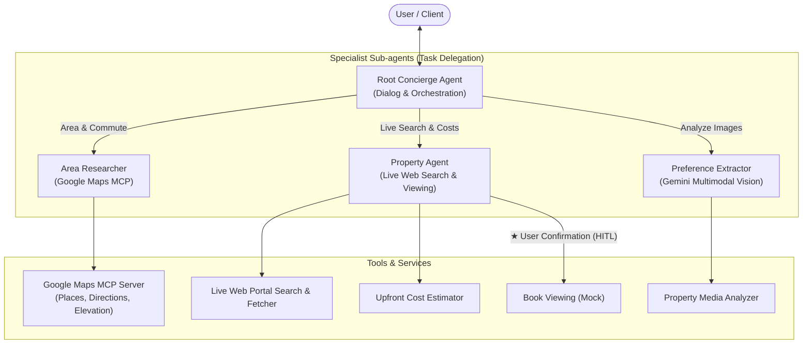

# Relocation Concierge Agent Specification

## 1. Overview & Value Propositions

**Relocation Concierge** is an intelligent conversational agent system built on Google ADK 2.0 that assists users throughout their relocation journey — from discovering lifestyle preferences and exploring neighborhoods to searching active real-world rental listings via live web browsing, calculating upfront moving costs, and safely booking viewing appointments.

### Core Value Propositions
1. **Interactive Lifestyle Discovery & Learning (Negative Feedback Loop)**:
   - Uncovers household needs and learns both positive priorities and deal-breakers (`user:dislikes`) so unwanted property types are never recommended twice.
2. **Objective Neighborhood Due Diligence via Google Maps**:
   - Leverages the Google Maps MCP toolset for dual-commute balance calculations, neighborhood amenities, and elevation/slope safety.
3. **Live Web Rental Search on Active Portals**:
   - Performs real-time web searches and page analyses on active rental portals (e.g., SUUMO, HOME'S) to discover currently vacant, available listings.
4. **Transparent Upfront Cost Estimation**:
   - Accurately calculates itemized move-in costs (~4.5x rent) when specific property terms are available, or provides reliable benchmark estimates based on user budget.
5. **Multimodal Preference Extraction**:
   - Analyzes uploaded floor plans and interior photos using Gemini Multimodal Vision to extract layout features and design aesthetics.
6. **Human-in-the-Loop (HITL) Viewing Booking**:
   - Operates fully autonomously for all research and analysis (Read), while strictly pausing for explicit user approval before scheduling viewing appointments (Write / Mock).

---

## 2. System Architecture



---

## 3. Agent Design & Orchestration

### 3.1. Specialist Agents & Tool Bindings

Domain knowledge from `SKILL.md` is embedded directly into each sub-agent's prompt instructions to guide expert evaluations.

| Agent Name | Mode | Domain Responsibility | Embedded Knowledge (`SKILL.md`) | Assigned Tools |
|---|---|---|---|---|
| **`root_concierge`** | `chat` | User dialog, intent routing, preference & dislike learning, moving consultation | - | Sub-agent delegation |
| **`area_researcher`** | `mode="task"` | Neighborhood discovery, commute calculations, and local amenity due diligence | `area-due-diligence` | **Google Maps Grounding Lite MCP Toolset** (`search_places`, `compute_routes`, `resolve_names`) |
| **`property_agent`** | `mode="task"` | Live web search on rental portals & sites, vacancy inspection, viewing scheduling | `live-property-search` | `GoogleSearchTool`, `load_web_page`, `book_viewing_tool` (★ HITL Mock) |
| **`cost_estimator`** | `mode="task"` | Itemized upfront move-in cost calculations & negotiation advice | `moving-cost-estimator` | `estimate_upfront_costs` |
| **`preference_extractor`** | `mode="task"` | Extracting layout/aesthetic keywords from floor plans & interior photos | Multimodal Vision guidelines | `analyze_property_media` |

### 3.2. Dynamic Persona & State Governance
- **Tone**: Empathetic, supportive, structured, and professional.
- **Dynamic Parameter**: `{concierge_persona}` (e.g., family-oriented warmth vs. fast-paced executive clarity).
- **State Initialization**: `before_agent_callback` ensures all required `user:` state keys (`user:family_structure`, `user:lifestyle_priorities`, `user:workplace`, `user:dislikes`, `user:viewing_history`) are initialized to prevent runtime exceptions.

---

## 4. Context, Memory & Artifacts Architecture

### 4.1. State & Memory Architecture

| Scope Type | Key Prefix | Lifecycle & Persistence | Managed Data |
|---|---|---|---|
| **User Scope** | **`user:*`** | **Persistent across sessions** for the user. | • `user:family_structure`<br>• `user:workplace`<br>• `user:lifestyle_priorities`<br>• `user:dislikes`<br>• `user:viewing_history` |
| **Session Scope** | *(no prefix)* | **Ephemeral / Transient**. Discarded after session ends. | • `candidate_properties`<br>• `current_query`<br>• `selected_property`<br>• `active_flow` |
| **App Scope** | `app:*` | Application-wide static configuration. | Global system parameters & rate limits |

### 4.2. Caching & Compaction
- **Context Caching**: Caches system prompts > 2,048 tokens (TTL: 1,800s).
- **Token-based Compaction**: Summarizes session history when context reaches **32,000 tokens**, preserving the last 6 raw interaction events.
- **Artifacts Service**: Stores uploaded floor plans and photos (JPEG/PNG) in GCS (`relocation-artifacts-prod`) or local in-memory store for development.

---

## 5. Tool & Interface Design

All tools are standalone, reusable function definitions. Tool assignment is configured at the agent level.

### 5.1. Tool Specification Matrix

| Tool Name | Execution Mode | Key Operations & Parameters | Return Data & Output | Description |
|---|---|---|---|---|
| **Google Maps Grounding Lite MCP**<br>(`https://mapstools.googleapis.com/mcp`) | Real Execution (Read) | • `search_places` (amenities, supermarkets, parks, clinics)<br>• `compute_routes` (commute travel duration & distance)<br>• `resolve_names` (Place ID resolution) | Standardized MCP structured JSON output | Interacts with official Google Maps Platform Grounding Lite service to explore candidate neighborhoods and measure commute routes. |
| **`GoogleSearchTool`** | Real Web Search (Read) | • query (str) | Real-time search engine organic results | Performs live Google Search across open web sources, rental portals (SUUMO, HOME'S, Zillow, etc.) for active vacancies. |
| **`load_web_page`** | Real Web Retrieval (Read) | • url (str) | Full text and metadata of target webpage | Retrieves listing details (rent, floor, amenities, pet rules) directly from discovered property webpages. |
| **`estimate_upfront_costs`** | Calculation Logic (Read) | • `monthly_rent_yen` (int, optional — defaults to target budget)<br>• `management_fee_yen` (int, default: 10000)<br>• `has_pet` (bool, default: False)<br>• `deposit_months` (float, optional)<br>• `key_money_months` (float, optional) | `monthly_rent_yen`, `total_upfront_yen`, `rent_multiplier`, `breakdown` (itemized fees), `cost_saving_tips`, `a2ui_card` | Calculates exact move-in costs if property terms are known, or simulates standard benchmark costs (~4.5x rent) from budget. |
| **`analyze_property_media`** | Real Vision (Read) | • `media_file_paths` (list[str] of image paths or URLs) | `extracted_features` (counter kitchen, walk-in closet, flooring tone, daylighting) | Utilizes Gemini Multimodal Vision to extract layout specifications and aesthetic preferences from uploaded images. |
| **`book_viewing_mock`** | **Mock (★ HITL Gate)** | • `property_id` (str)<br>• `preferred_datetime` (str)<br>• `applicant_name` (str)<br>• `contact_phone` (str) | `booking_id`, `status` (confirmed), `confirmation_message`, `meeting_instructions` | Simulates booking a viewing appointment. **Requires explicit user approval (`require_confirmation=True`) before executing.** |

### 5.2. Human-in-the-Loop (HITL) Governance
- **Approval Gate**: `book_viewing_tool = FunctionTool(book_viewing_mock, require_confirmation=True)` pauses execution before booking.
- **Confirmation Card**: Presents candidate property details, date/time, and applicant info to the user for one-click approval (`Proceed` / `Cancel`).

---

## 6. Domain Knowledge (`SKILL.md`) Organization

Static domain skills embedded directly in project packages:

```
app/skills/
├── live-property-search/SKILL.md   # Portal query optimization & expired listing detection signals
├── area-due-diligence/SKILL.md     # Commute equity and amenity assessment
└── moving-cost-estimator/SKILL.md  # Upfront moving fee calculations & standard rate benchmarks
```

---

## 7. BDD-Style Gherkin Specification

```gherkin
Feature: Relocation Concierge - Moving & Housing Assistance Agent

  Background:
    Given the user has started a Relocation Concierge session

  Scenario: Collect and persist profile across sessions
    Given the user is a first-time visitor
    When the user says "I am planning to move by next spring with my spouse"
    Then the concierge inquires about workplace locations and family structure
    When the user responds "Husband works in Shibuya, wife in Marunouchi"
    Then `user:family_structure` and `user:workplace` are saved to persistent memory
    And the concierge suggests transit-balanced neighborhoods

  Scenario: Neighborhood due diligence via Google Maps
    Given the user wants to check neighborhood suitability around "Meguro"
    When Area Researcher evaluates the area using Google Maps MCP
    Then it calculates commute routes and durations to workplaces via `compute_routes`
    And checks grocery stores and parks proximity within walking distance via `search_places`

  Scenario: Live rental search excluding user dislikes
    Given `user:dislikes` contains ["unit_bath", "first_floor"]
    When the user requests "Search 1LDK apartments in Meguro under 200,000 JPY"
    Then Property Agent searches active rental listings on the web
    And strictly filters out ground-floor and combined-unit-bath properties

  Scenario: Flexible upfront cost estimation
    When the user asks "How much upfront moving cost should I expect for a 180,000 JPY rent?"
    Then Property Agent runs `estimate_upfront_costs` with target rent 180,000 JPY
    And returns an itemized cost breakdown card (~800,000 JPY / 4.4x rent) and negotiation tips

  Scenario: Extract preferences from uploaded floor plans
    Given the user uploads 2 floor plan images
    When Preference Extractor analyzes the images
    Then it identifies "open counter kitchen" and "walk-in closet"
    And updates `user:lifestyle_priorities`

  Scenario: Require explicit user approval before booking a viewing (HITL Gate)
    Given the user selects candidate property "Grand Residence Meguro 402"
    When the user says "Book a viewing for this Saturday at 2 PM"
    Then Property Agent prepares a confirmation card (Property, DateTime, Applicant Info)
    And pauses execution to request explicit user confirmation
    When the user confirms
    Then `book_viewing_mock` executes and returns a booking confirmation ID
```

---

## 8. Observability & Tracing Architecture (OpenTelemetry Standards)

- **Distributed Tracing**: Captures agent delegation hierarchy (Root ➔ Sub-agents), tool invocations, and LLM inference latency.
- **Structured Audit Logs & Feedback**: Records full prompt-response pairs and user feedback ratings.
- **Exporters**: Pluggable OTel exporters for Cloud Trace, Cloud Logging, BigQuery, Datadog, and local console.

---

## 9. Infrastructure & Deployment

- **Deployment Targets**: Google Cloud Run (Serverless), Vertex AI Agent Runtime, Google Kubernetes Engine (GKE).
- **IaC & Security**: Terraform provisioning, least-privilege IAM service accounts, and Secret Manager for Google Maps API keys.

---

## 10. CI/CD Pipeline & Quality Flywheel (Evaluation)

1. **Lint & Type Check**: `agents-cli lint` (ruff, pyright)
2. **Unit Tests**: `pytest tests/unit`
3. **ADK Evaluation Gate**: `agents-cli eval run --config tests/eval/eval_config.yaml`
   - `multi_turn_task_success`: End-to-end task completion rate
   - `multi_turn_tool_use_quality`: Accuracy of tool selection and arguments
   - `hitl_compliance_metric`: Custom LLM-judge ensuring booking tools are NEVER called without prior confirmation
